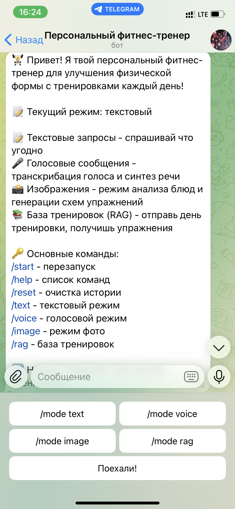

<div align="center">

# 🤖 AI Fitness Trainer Bot

[](https://python.org/)
[](https://core.telegram.org/)
[](https://openai.com/)
[](LICENSE)

**Мультимодальный Telegram-бот с AI-тренером для персонализированных тренировок**

[Возможности](#-возможности) • [Установка](#-установка) • [Использование](#-использование) • [Архитектура](#-архитектура)

</div>

---

## 🏋️ Описание

**AI Fitness Trainer Bot** — это бесплатный 4-недельный персональный фитнес-тренер для улучшения физической формы с тренировками каждый день.

Бот использует технологию RAG (Retrieval-Augmented Generation) для генерации персонализированных планов тренировок на основе ваших данных.

---

## ✨ Возможности

| Возможность | Описание |
|-------------|----------|
| 📝 **Текстовые запросы** | Спрашивай что угодно о тренировках и питании |
| 🎤 **Голосовые сообщения** | Отправь голос → получи голосовой ответ. **Только в `/mode voice`** |
| 📸 **Анализ фото еды** | Пришли фото блюда → узнай калории и БЖУ. **Только в `/mode image`** |
| 🎨 **Генерация схем упражнений** | Спроси "как делать присед" → получи схему. **Только в `/mode image`** |
| 📚 **База тренировок (RAG)** | 100+ упражнений, 28 дней тренировок |
| 🎯 **Персонализация** | Учёт возраста, веса, цели и ограничений |

---

## 🚀 Установка

### 1. Клонирование репозитория

```bash
git clone https://github.com/yourusername/multimodal-ai-rag-fitness-trainer.git
cd multimodal-ai-rag-fitness-trainer
```

### 2. Создание виртуального окружения

```bash
python -m venv venv
source venv/bin/activate  # Linux/macOS
# или
.\venv\Scripts\activate  # Windows
```

### 3. Установка зависимостей

```bash
pip install -r requirements.txt
```

### 4. Настройка окружения

Создайте файл `.env` на основе `.env.example`:

```env
# Telegram
TG_TOKEN=your_telegram_bot_token

# ProxyAPI (OpenAI через прокси)
PROXYAPI_KEY=your_proxyapi_key
OPENAI_BASE_URL=https://api.proxyapi.ru/openai/v1

# Опционально: прямой OpenAI API
# OPENAI_API_KEY=your_openai_api_key
```

### 5. Установка FFmpeg (для голосовых сообщений)

FFmpeg требуется для конвертации аудио в формат Telegram:

```bash
# Windows (winget)
winget install FFmpeg

# Windows (Chocolatey)
choco install ffmpeg

# Linux
apt install ffmpeg

# macOS
brew install ffmpeg
```

### 6. Запуск

```bash
python main.py
```

---

## 📖 Использование

### Команды

| Команда | Описание |
|---------|----------|
| `/start` | Перезапуск бота |
| `/help` | Справка по боту |
| `/reset` | Очистка истории |
| `/stats` | Статус базы знаний |
| `/index` | Переиндексация базы знаний |
| `/mode` | Переключение режимов |
| `/rag` | Объяснение работы RAG |

### Режимы работы

#### 📝 Текстовый режим (`/mode text`)
Спрашивай что угодно о тренировках, питании, технике упражнений. Получай подробные текстовые ответы от AI-тренера.

#### 🎤 Голосовой режим (`/mode voice`)
Отправляй голосовые сообщения — бот распознает речь через Whisper и **ответит голосом через TTS**. Удобно во время тренировки!

> ⚠️ **Важно:** В этом режиме бот **обязательно отвечает голосом**. Текстовые ответы не отправляются.

**Поток обработки:**
```
OGG (Telegram) → WAV → Whisper → LLM → TTS → OGG → Voice
```

#### 📸 Режим изображений (`/mode image`)
Два независимых типа запросов:

1. **Фото еды** → бот отправляет **ТЕКСТ** с калориями и БЖУ
2. **Текст "как делать присед"** → бот отправляет **ТОЛЬКО ИЗОБРАЖЕНИЕ** со схемой упражнения

> ⚠️ **Важно:** В этом режиме бот **не общается текстом** при генерации упражнений. Только изображения!

**Примеры запросов:**
| Запрос | Ответ |
|--------|-------|
| Отправь фото салата | 📊 Калории: ~150 ккал, БЖУ... (ТЕКСТ) |
| "Как делать присед?" | 🏋️ [Изображение схемы] (ТОЛЬКО ФОТО) |

---

## 🏗️ Архитектура

```
multimodal-ai-rag-fitness-trainer/
├── bot.py                    # Конфигурация бота, хендлеры
├── main.py                   # Точка входа
├── requirements.txt          # Зависимости
├── .env.example              # Шаблон окружения
├── .gitignore                # Git ignore файл
├── LICENSE                   # MIT License
├── README.md                 # Документация
│
├── handlers/                 # Обработчики сообщений
│   ├── start.py              # /start, /help, /reset, /stats, /mode, /rag
│   ├── text.py               # Текстовые сообщения + роутинг генерации упражнений
│   ├── voice.py              # Голосовые сообщения (STT → LLM → TTS)
│   ├── image.py              # Анализ фото еды → ТЕКСТ (БЖУ, калории)
│   ├── image_generation.py   # Генерация схем упражнений → ТОЛЬКО ИЗОБРАЖЕНИЕ
│   ├── rag.py                # Генерация тренировок из базы знаний
│   └── document_upload.py    # Загрузка документов в RAG
│
├── services/                 # Бизнес-логика
│   ├── openai_client.py      # Unified OpenAI API wrapper
│   └── router.py             # Маршрутизация запросов к LLM
│
├── utils/                    # Утилиты
│   ├── file_utils.py         # Работа с файлами, логирование
│   ├── speech_to_text.py     # Whisper STT
│   ├── text_to_speech.py     # OpenAI TTS + конвертация в OGG
│   └── vision.py             # GPT-4 Vision функции (анализ еды, проверка)
│
├── data/                     # Данные RAG
│   ├── fitness_rag.py        # RAG система (ChromaDB)
│   └── fitness_rag_data/     # База знаний
│       ├── exercises_library.json
│       ├── workout_plans_full.json
│       ├── warmup_routine.json
│       ├── muscle_groups.json
│       └── equipment_list.json
│
└── user_data/                # Данные пользователей (авто-создание)
```

---

## 📦 Модели OpenAI

| Задача | Модель | Файл |
|--------|--------|------|
| Текстовые ответы | `gpt-4o-mini` | `services/openai_client.py` |
| Vision (анализ фото) | `gpt-4o-mini` | `utils/vision.py`, `services/openai_client.py` |
| STT (голос→текст) | `whisper-1` | `utils/speech_to_text.py` |
| TTS (текст→голос) | `tts-1` | `utils/text_to_speech.py` |
| Генерация изображений | `gpt-image-1` | `services/openai_client.py` |

---

### Детальное описание компонентов

#### `bot.py`
Центральный файл конфигурации бота на базе `python-telegram-bot==20.8`. Содержит:
- Инициализацию `ApplicationBuilder`
- Регистрацию всех обработчиков (CommandHandler, MessageHandler, ConversationHandler)
- Глобальный обработчик ошибок `error_handler`
- Клавиатуры для навигации (`MODES_KEYBOARD`, `AFTER_SAVE_KEYBOARD`)

#### `main.py`
Точка входа приложения. Вызывает `bot.main()` и настраивает логирование уровня `INFO`.

#### `handlers/`

| Файл | Назначение | Вывод |
|------|------------|-------|
| `start.py` | Команды `/start`, `/help`, `/reset`, `/stats`, `/mode`, `/rag`. Приветствия, переключение режимов | Текст |
| `text.py` | Текстовые сообщения. Перехватывает кнопки ("Поехали!", "Сохранить", "Получить тренировку"). Вызывает `image_generation` для запросов об упражнениях | Текст / Изображение |
| `voice.py` | Обработка голоса: OGG → WAV → Whisper → LLM → **TTS → OGG**. В режиме `/mode voice` бот **обязательно отвечает голосом** | Голос (OGG) |
| `image.py` | Анализ фото еды: проверка режима `/mode image` → Vision API → расчёт калорий/БЖУ. Отправляет **ТЕКСТ** | Текст |
| `image_generation.py` | Генерация схем упражнений: поиск ключевых слов ("как делать присед") → DALL-E → отправляет **ТОЛЬКО ИЗОБРАЖЕНИЕ**. Если не в режиме image — подсказка переключиться | Изображение |
| `rag.py` | Работа с базой знаний: получение тренировки по дню, завершение, предложение следующей | Текст |
| `document_upload.py` | Индексация пользовательских PDF/TXT/MD в ChromaDB | Текст |

#### `services/`

| Файл | Назначение |
|------|------------|
| `openai_client.py` | Единый клиент для всех моделей OpenAI через ProxyAPI. Поддерживает: `gpt-4o-mini` (текст), `whisper-1` (STT), `tts-1` (TTS), `gpt-image-1` (DALL-E), `gpt-4o-mini` (Vision) |
| `router.py` | «Диспетчер» запросов. Определяет тип запроса и отправляет в соответствующий сервис. Содержит RAG-пайплайн с ChromaDB |

#### `utils/`

| Файл | Назначение |
|------|------------|
| `file_utils.py` | Сохранение пользовательских данных, настройка логов, создание временных директорий |
| `speech_to_text.py` | Конвертация OGG (Telegram) → WAV → транскрибация через Whisper (`whisper-1`) |
| `text_to_speech.py` | Синтез речи через OpenAI TTS (`tts-1`). Конвертация OPUS → OGG для Telegram через FFmpeg |
| `vision.py` | Helper-функции для анализа изображений: `analyze_food_image()`, `is_food_image()`, `analyze_any_image()` |

#### `data/`

**RAG-система** использует ChromaDB + SentenceTransformers для хранения и поиска информации о тренировках. Три коллекции:

| Коллекция | Описание |
|-----------|----------|
| `exercises` | 100+ упражнений с описанием, мышцами, оборудованием |
| `workout_plans` | 28 готовых планов тренировок (4 недели × 7 дней) |
| `warmup` | Разминки и растяжки |

---

## 📸 Скриншоты

### Главное меню и `/start`



**Тестовые скриншоты работы бота и всех модальностей** доступны в папке [docs/images](docs/images).

---

## 📄 Лицензия

MIT License — подробности в файле [LICENSE](LICENSE)

---

## 📞 Контакты

**Автор**: Ivan P

**Telegram**: [@nonoyessure](https://t.me/nonoyessure)

---

<div align="center">

**⭐ Ставь звезду, если проект полезен!**

Сделано с ❤️

</div>
